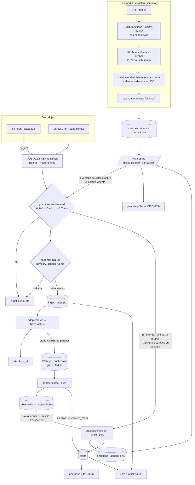

# Cómo funciona marcador.gal

> Explicación del sistema tal como está hoy (2026-09-22, SPEC-008 cerrada).
> No es una spec ni un ADR: no decide nada, cuenta **por qué** lo decidido está
> donde está. El *qué* se lee en el código; lo que se evapora es el porqué.
> Cuando este documento y el código discrepen, manda el código.

---

## El recorrido de una jornada

El lazo `board → ventana` no es un error del dibujo: un partido sale de la
ventana **por tiempo o porque su Decision vigente dice `finished`**, así que el
resultado del motor decide a quién se le pregunta en el tick siguiente.

---

## 1. El calendario declarado

La autoridad sobre **qué partidos existen** es `data/calendario/<temporada>/`,
cinco ficheros JSON versionados en el repo: 1.834 partidos y 98 equipos en
2026-27 (380 Primera, 462 Segunda, 380 Primera RFEF G1, 306 Segunda RFEF G1,
306 Tercera RFEF G1). No es un caché del proveedor: es la fuente de verdad
(D-3).

La razón es el `MatchId`. Se deriva —`<competición>-<temporada>-j<ronda>-<local>-<visitante>`—
y no lo da nadie de fuera. Un partido aplazado del sábado al miércoles sigue
siendo el mismo partido, con el mismo id, y todo lo que cuelga de él
(observations, decisions, alerts) sigue apuntando al sitio correcto. Si el id
viniera del proveedor, cambiar de proveedor sería migrar la base entera.

El proveedor entra como **importador**, no como autoridad. `npm run calendario:sync`
lee API-Football, lo cruza con los alias de `data/alias/<temporada>/` y reescribe
los ficheros; `syncCalendar` devuelve además un diff legible (`añadidos`,
`reprogramados`, `ausentes`, `renombrados en el proveedor`, `equipos nuevos`
marcados `REVISAR`). El workflow `calendario-semanal.yml` lo corre **los martes a
las 05:00Z** —entre jornadas, con tiempo de revisar antes del viernes— y, **solo
si hay diff**, abre un PR con ese diff en el cuerpo. Al fusionar, el job `load`
salta en el `push` a `main` con `paths: [data/calendario/**, data/alias/**]` y
carga la base.

Un humano en medio, y no un cron que escriba directo, porque el evento que este
camino existe para cazar es **el aplazamiento**: alguien tiene que mirar que el
Arousa - Bergantiños que se mueve tres días se mueve de verdad. Y el sync
reescribe ficheros, cosa imposible en el filesystem de solo lectura de una
función serverless.

**Cicatriz — el orden por `kickoff` enterraba justo lo que había que ver.**
Los partidos se ordenaban por hora de comienzo. Un aplazamiento mueve el
partido de sitio en el fichero y arrastra el bloque entero: la primera pasada
real del sync produjo **619 líneas añadidas y 619 borradas en cinco ficheros**,
con el aplazamiento perdido dentro. Ahora se ordenan por `round + home + away`
—que es el id derivado, y no cambia nunca—, así que un aplazamiento **reescribe
un `kickoff` en su sitio**: `1 file changed, 1 insertion(+), 1 deletion(-)`. De
paso, las comparaciones de texto pasaron de `localeCompare` a orden de code
point: el sync corre en un runner de GitHub y la revisión se hace en un
portátil, y `localeCompare` sin locale explícito es libre de diferir entre los
dos (F-SPEC-008-20, comentario en `src/calendar/sync.ts`).

**Cicatriz — un `tee` sin `pipefail` se tragaba la caída del proveedor.** El
paso de sincronización era `npm run calendario:sync -- "$TEMPORADA" | tee sync-diff.txt`
sin `shell: bash`. El shell por omisión de GitHub en Linux es `bash -e {0}`,
**sin `pipefail`**, así que el estado del paso era el de `tee` (siempre 0) y no
el de `calendario:sync`, que sale 1 cuando el proveedor devuelve `errors`. Modo
de fallo completo y silencioso: el proveedor cae un martes → el paso «pasa» →
no hay diff → no se abre PR → la sincronización semanal no hace nada y nadie se
entera. Arreglado con `shell: bash` (que da `-eo pipefail`) y con un test de
arquitectura que exige shell explícito en todo paso con tubería
(F-SPEC-008-7, `src/arch/deploy.test.ts`).

---

## 2. La ventana

Un partido está **en ventana** desde `kickoff − 10 min` hasta `kickoff + 150 min`,
y sale antes si su Decision vigente ya dice `finished` (`src/ingest/window.ts`,
`WINDOW_BEFORE_MINUTES` / `WINDOW_AFTER_MINUTES`).

Los diez minutos de antes son para llegar al pitido inicial con el partido ya
observado: el primer `live` no puede esperar al tick siguiente. Los 150 de
después cubren 90 + descanso + añadidos + una interrupción larga. Y hay una
relación que conviene no romper sin pensarlo: el barrido del motor solo recorre
los partidos **en ventana**, así que el cierre forzoso de `kickoff + 120 min`
(§6) solo puede dispararse porque la ventana llega a 150. Acortarla por debajo
de 120 lo desactivaría en silencio.

`isInWindow` es una función pura que recibe `now`; la consulta a `board` solo
acota por `kickoff` para no traerse la temporada entera y el filtro fino lo hace
la función. Compara **milisegundos, no texto**: dos escrituras del mismo instante
no pueden ordenarse distinto.

Fuera de ventana **no hay ni petición ni fila**. Es deliberado y tiene precio:
el tick de las tres de la mañana no deja rastro ninguno en base, así que su
vitalidad hay que mirarla en `cron.job_run_details` y en los logs de Vercel
(§8). Se descartó una fila de latido por tick porque son 2.880 filas al día sin
un solo dato dentro (ADR-008, alternativas).

---

## 3. El tick: dos relojes

`POST /api/ingest/tick` (y `GET`, ver abajo). Autenticación: `Authorization:
Bearer <INGEST_TICK_TOKEN>`, mínimo 32 caracteres, comparado con
`timingSafeEqual`. **Sin token configurado el endpoint responde 503 y no corre**:
nunca un tick sin llave. `runtime = "nodejs"` porque `node:zlib`, `postgres.js`
y `node:fs` descartan Edge.

Lo disparan dos relojes:

- **pg_cron cada 30 s**, dentro de Postgres, llamando por `pg_net` con
  `timeout_milliseconds: 55000`. Es el reloj principal porque 30 s es la
  cadencia que queremos y ningún cron de plataforma baja del minuto.
- **Vercel Cron cada minuto** (`vercel.json`), como respaldo. Vercel Cron invoca
  por `GET` con `Authorization: Bearer $CRON_SECRET`, así que `CRON_SECRET` lleva
  el mismo valor que `INGEST_TICK_TOKEN` y la ruta exporta `export const GET = POST`.
  No hay una segunda ruta a propósito: `outputFileTracingIncludes` se indexa por
  path, y una ruta nueva se desplegaría **sin el fichero de alias**.

Por qué dos y no uno: pg_cron a 30 s estaba documentado como soportado pero
nunca lo habíamos visto correr, y es el único componente del sistema que vive
dentro de la base de datos —si el proyecto de Supabase se pausa, el reloj se
para con él. Vercel Cron es la red de seguridad que se dispara desde el otro
lado. No se mezclan con los **tres relojes de la frescura** de D-9 (el del dato,
el de la fuente y el del navegador), que son otra cosa y no se tocan aquí.

Dos disparadores solapados serían dos sondeos, y eso rompe RN-08. La guarda de
cadencia vive en `openAttempt`: una transacción con `pg_advisory_xact_lock` por
fuente que mira el último `started_at` y **salta la fuente** si es más reciente
que `minIntervalSeconds − 5 s`. Los cinco segundos son tolerancia al jitter de
los dos relojes; el precio, escrito para que nadie lo redescubra, es que en el
peor caso dos llamadas pueden ir separadas 25 s. La guarda está donde tiene que
estar —en la base, bajo lock, no en el disparador—, así que hasta tres
invocaciones por minuto producen **una sola llamada al proveedor**. El lock es
`xact`, no de sesión: el pooler transaccional no conserva sesiones.

Orden de un intento, y no otro (ADR-008 §4):
`ingest_attempts` → `fetch` → **guardar crudo** → `parse` → una transacción con
`observations` + alertas `unresolved_team` + `afterInsert` → cierre del intento
con contadores en `details`. El error de una fuente se anota en su fila y no
toca a las demás.

El reloj entra **en el borde**: `now` lo pone la ruta (o la CLI) y viaja como
`Instant`; nada bajo `src/ingest/` ni `src/raw/` consulta la hora. Por eso el
tick entero se prueba en CI con dobles: `IngestDb` es un puerto con
implementación `postgres.js` y otra en memoria, y `npm run ingest:tick` corre
el mismo núcleo sin HTTP.

---

## 4. El crudo primero

Antes de interpretar nada, la respuesta entera de la fuente se comprime con gzip
y se sube a Supabase Storage. Bucket privado `raw`, sin ninguna política en
`storage.objects`: ni `anon` ni `authenticated` ven nada, solo el servidor con la
clave de servicio. Clave
`<sourceId>/<YYYY-MM-DD>/<capturedAt sin ':'>-<attemptId>.json.gz`, y
`raw_ref = raw/<clave>`, que es lo que llevan `observations.raw_ref`,
`ingest_attempts.raw_ref` y `alerts.details.rawRef`. Se escribe por la API REST
de Storage con `fetch`, no con `supabase-js` (ADR-001 lo restringe al cliente, y
esto son un `PUT` y un `DELETE`).

«Crudo antes que parseo» es en sentido fuerte: **si `put` falla, el intento falla
y no se parsea nada**.

Qué se gana, que es lo que justifica los ~100 ms extra por intento:

- **Replay.** El motor es determinista sobre el log de observaciones, y las
  observaciones se pueden regenerar desde el crudo. Eso parte el riesgo de una
  jornada en dos mitades muy distintas: si la **ingesta** falla, lo perdido es
  irrepetible y hay que esperar a la semana siguiente; si falla el **motor**, se
  arregla el motor y se recalcula sobre lo guardado. Los 30 días de retención son
  exactamente el margen que tiene ese recálculo (SPEC-009 CA-9, rama c2).
- **Auditoría.** Toda Decision publicada cita las Observations que la sostienen,
  y toda Observation cita el cuerpo HTTP del que salió. La cadena llega hasta los
  bytes.
- **Fixtures reales.** Los adaptadores se prueban contra cuerpos que el
  proveedor produjo de verdad, no contra JSON inventado.

Un objeto por captura (la `RawCapture` entera, con todas sus `requests`), porque
es lo que `parse` ve junto. La retención de 30 días la ejecuta **el propio tick**
—como mucho una vez cada 24 h, reintento a la hora si falla, lotes de 1.000— y
nunca detiene la ingesta: el tick lee el resultado y sigue. No hay job diario
aparte, que sería un segundo reloj que mantener. Y se borra **por la API**,
jamás con `delete from storage.objects`, que dejaría los ficheros huérfanos en el
almacén.

---

## 5. Las fuentes

Toda fuente implementa `SourceAdapter` (ADR-003, D-4): `fetch` (red, recibe los
partidos en ventana), `parse` (**puro**), `verify`/`ingest` para las push, y
`resolveTeam`. El adaptador **nunca escribe en base de datos**: devuelve
`ParsedObservation`, y el núcleo le pone id, `sourceId`, `receivedAt` y `rawRef`.

El **registro** (`src/sources/registry.ts`) es configuración validada con zod al
importar, no código ramificado: por fuente, su tipo, las competiciones que cubre,
**la prioridad por competición**, la cadencia mínima, el user-agent y un
`legalBasis` de texto libre que solo se anota. La base legal la gestiona el
titular fuera del repo (D-7): evaluarla en código bloqueó la versión anterior del
proyecto.

Hoy hay una sola fuente: `api-football`, prioridad **10** en las cinco
competiciones, cadencia 30 s. Los huecos de la escala están elegidos a
propósito: 5 para un agregador de respaldo, 20 para un segundo proveedor, **50
federación**, **100 operador**. Añadir una fuente es añadir una carpeta con su
adaptador, sus fixtures y su mapa de alias, más una línea en el registro. Nunca
una rama en el código común.

Todo el vocabulario del proveedor se traduce **dentro del adaptador** a los cinco
estados del dominio, en una tabla explícita (`STATUS` en `results.ts`), y **lo
que no está en la tabla se salta y se cuenta**: el día que el proveedor invente
un `status.short` nuevo, aparece en `skipped`, no como un estado inventado en
pantalla. Y el adaptador pide lo mínimo que RN-08 permite: una llamada `live=`
solo si algo ha empezado ya, y después `ids=` en lotes de 20 con lo que esa
respuesta no traía.

La identidad es **todo o nada** (RN-10): una observación solo se acepta si su
local y su visitante resuelven a un único `Match` del calendario declarado. Si
no, no se inventa un partido: se abre una alerta.

---

## 6. El motor

`src/decide/` es una **función pura**. Entrada: la Decision vigente (o ninguna),
las Observations recientes, las prioridades **como función**, y `now` **como
parámetro**. Salida: un borrador de Decision o `null`, más alertas que abrir y
que cerrar. Sin reloj, sin red, sin base de datos, sin `id` ni `version` (los
pone Postgres).

Qué se ganó con esa disciplina, que es la pregunta que importa:

1. **Replayable.** Dado el log de observaciones, reproduce el log de decisiones
   (`src/decide/replay.ts` dobla `decide()` sobre los instantes del log). Es lo
   que convierte «el motor se equivocó» en un arreglo de una tarde en vez de en
   una semana perdida.
2. **Testable sin infraestructura.** Todos los casos de RN-01..RN-06 corren en
   Vitest sin Postgres, sin red y sin fixtures de base.
3. **Una página de reglas legibles.** Todos los umbrales en
   `src/decide/thresholds.ts`, cada uno con la regla que lo fija al lado.

Las reglas, en prosa:

- **RN-01 Prioridad.** Entre las observaciones de menos de 5 minutos, gana la de
  la fuente con mayor prioridad para esa competición; a igual prioridad, la más
  reciente; a igual instante, el id, para que el mismo conjunto siempre pliegue
  igual. La antigüedad se mide con `observedAt`, el reloj de la fuente.
- **RN-02 Transiciones.** `scheduled → live` solo si el kickoff está a menos de
  15 minutos (un `live` reclamado demasiado lejos se descarta en silencio, no
  alerta). `postponed` y `suspended` solo desde prioridad de federación o del
  operador. De `finished` no se vuelve salvo por el operador. Y el **cierre
  forzoso**: a `kickoff + 120 min` un partido `live` se publica `finished` con el
  marcador vigente y cualificador `provisional`.
- **RN-03 Monotonía.** Un marcador no baja salvo por el operador. Si la fuente
  ganadora propone un marcador menor, se publica su estado **llevando puesto el
  marcador vigente** y se abre una alerta.
- **RN-04 Conflicto.** Si dos fuentes de prioridad igual o adyacente discrepan
  más de 3 minutos, no se publica nada: se mantiene la Decision vigente y se
  alerta. Con una sola fuente registrada hoy no se dispara nunca.
- **RN-05 Silencio.** Un `live` sin observación de nadie en 15 minutos pasa a
  cualificador `sen_sinal` y alerta. Al volver la señal recupera su cualificador
  normal y **el motor cierra esa alerta él mismo**: es la única que se
  autorresuelve.
- **RN-06 Trazabilidad.** Toda Decision registra la regla decisiva y los ids de
  las observaciones que la sostienen.

**El orden de evaluación** es `operator → cierre forzoso RN-02 → RN-05 → guarda
de legalidad de transición → RN-03 → RN-04 → RN-01`. Dos de esos pasos —la
guarda de transición y RN-04— **nunca publican**, y por eso nunca aparecen en
`Decision.rule`: `rule` solo admite `operator`, `RN-01`, `RN-02`, `RN-03` y
`RN-05` (hay un `check` en la tabla). La precedencia de RN-06 gobierna qué regla
se *registra* cuando sí se publica, no el orden en que se evalúan las guardas.

**El cualificador es derivado, no una columna más de entrada.** `confirmado` si
la fuente ganadora tiene prioridad de federación o superior, o si una segunda
fuente coincide en estado y marcador (y entonces se cita también su observación);
`provisional` en cualquier otro caso; `sen_sinal` por RN-05. Con una sola fuente
de prioridad 10, hoy **todo lo que se publica es `provisional`**. Es el precio
aceptado de haber descartado el motor de pesos heredado: «provisional a tiempo
antes que confirmado tarde».

### Por qué dos enganches

El motor corre **dos veces por tick**:

**(a) `afterInsert`**, dentro de la misma transacción que insertó las
Observations, sobre los partidos observados. Un gol se publica con el dato que
lo trajo, en la misma transacción, sin latencia añadida.

**(b) El barrido** (`createEngineSweep`), al final del tick, en **su propia
transacción**, sobre **todos** los partidos en ventana.

El barrido existe porque `afterInsert` no corre si nadie insertó nada, **y eso es
exactamente lo que pasa cuando la fuente calla**. RN-05 y el cierre forzoso nacen
de la *ausencia* de datos: sin barrido no se dispararían jamás, precisamente en
el escenario para el que se escribieron. Lo ya decidido en (a) sale `null` en (b)
por idempotencia, así que no se escribe ni se cuenta dos veces. Un fallo del
barrido no tumba el tick: queda en `TickSummary.engineError`.

La idempotencia se mide sobre **la tupla publicada**: `(status, score, minute,
addedMinute, qualifier)`, con el minuto dentro y la `rule` fuera. Nace una
Decision nueva con cada cambio de esa tupla. Cuesta del orden de una Decision
cada 30 s por partido en juego —~160 por partido, ~8.000 por jornada de cinco
ligas según la estimación de ADR-009, **sin medir todavía**— y se paga para que
el minuto avance en pantalla.

### Por qué el cierre forzoso abre alerta

A `kickoff + 120 min` se publica un `finished` que **ninguna fuente ha
confirmado**, y se publica aunque sigan llegando observaciones `live`. Es un
resultado potencialmente falso. La propuesta original era hacerlo en silencio; se
rechazó en el gate con un argumento de una línea: *publicar un resultado falso
con rastro es mejor que publicarlo sin rastro*. Así que **siempre** abre una
alerta `forced_finish` con `score`, `minute`, `kickoff`, `lastObservedAt` y
`lastStatus`, y no se autorresuelve nunca: la cierra el operador.

Ese rastro obligó a una cuarta consulta, `lastHeard`, y el detalle merece
recordarse: la primera versión sacaba «lo último que se oyó» de la ventana de 15
minutos, y por tanto salía `null` **exactamente en el caso de silencio**, que era
su única razón de ser. Ahora es un `distinct on (match_id)` sin cota de tiempo.
`lastHeard` no cambia qué Decision se produce, solo los `details`, y por eso el
replay no lo pasa y sigue siendo autocontenido.

---

## 7. Las alertas

Cinco clases, todas en la tabla `alerts`, todas **para el operador y nunca para
el público**. Una alerta abierta por `(kind, match_id)` mientras nadie la
resuelva: un partido que retrocede el marcador cada 30 s abre **una** alerta, no
sesenta.

| Clase | Quién la abre | Qué significa |
|---|---|---|
| `regression` | motor (RN-03) | La fuente ganadora propuso un marcador menor que el publicado. Se mantuvo el vigente. |
| `conflict` | motor (RN-04) | Dos fuentes de prioridad adyacente llevan más de 3 min discrepando. **No se publicó nada.** |
| `silence` | motor (RN-05) | Un `live` lleva 15 min sin que nadie diga nada. Es la única que **se cierra sola** al volver la señal. |
| `forced_finish` | motor (RN-02) | Se publicó un `finished` que nadie confirmó, a kickoff + 120 min. |
| `unresolved_team` | **la ingesta** (RN-10) | Llegó una observación cuyos equipos no resuelven a un único partido del calendario. |

`unresolved_team` es la rara, y lo es por tres motivos a la vez:

1. **No la abre el motor**, la abre el adaptador de ingesta al parsear. De hecho
   el tipo `AlertDraft` de `src/decide/` la excluye explícitamente: el motor no
   puede producirla ni por accidente.
2. **Es la única sin `match_id`** —hay un `check` en la tabla que lo permite solo
   para ella—, porque su naturaleza es justamente que no sabemos de qué partido
   habla.
3. **Se deduplica por `(fuente, id externo del partido)`**, no por `(kind, match)`,
   porque no hay partido con el que deduplicar. Y si la fuente no da ni siquiera
   un id externo, no hay clave y no se deduplica.

Dicho de otro modo: las otras cuatro dicen «algo va mal con **este** partido»; la
quinta dice «no sé de qué partido me están hablando». Es el precio de RN-10: un
equipo sin alias no se adivina, se denuncia.

---

## 8. Cómo se mira si está vivo

`npm run tick:salud`. `src/ingest/salud.ts` es puro —recibe filas, devuelve
`{ ok, text }`— y `tools/tick-salud.mjs` es la cáscara que consulta `cron.job`,
`cron.job_run_details`, `net._http_response`, `ingest_attempts`, las alertas sin
resolver y los partidos en ventana. Sale 1 si `!ok`. **Redacta todo secreto** que
aparezca en cualquier campo, venga de donde venga, para que el informe se pueda
pegar en un ledger sin pensarlo.

Hay **tres** motivos de rojo:

1. Una ejecución de pg_cron fallida en la ventana reciente.
2. Un `ingest_attempts` con `ok = false` en la ventana reciente.
3. **Cero ejecuciones en la ventana reciente habiendo al menos un job en
   `cron.job`.** Un job presente pero `INACTIVO` también es rojo: un tick apagado
   a mano no es una base nueva. Solo un `cron.job` vacío es inocente —eso sí es
   una base recién creada, donde no hay nada programado y por tanto nada que
   esperar.

**Cicatriz — el semáforo decía OK con pg_cron muerto.** El tercer motivo no
estaba. `ok` solo miraba fallos, y cero ejecuciones no es un fallo: si el job
dejaba de dispararse del todo, `tick:salud` imprimía su informe completo, decía
**OK** y salía 0. O sea, el fallo más grave y más probable —el que el semáforo
existe para cazar el viernes por la tarde— era indistinguible de un sistema sano.
Arreglarlo cambiaba la letra del criterio de aceptación, así que se enmendó la
spec antes del ensayo, no el ledger (F-SPEC-008-14). Y cuando es ese motivo el
que enciende el rojo, el cierre **nombra la razón**: un semáforo rojo sin motivo
manda a cavar.

**Por qué la ventana del veredicto son 10 minutos y no 15.** El veredicto se
decide sobre los últimos 10 minutos; la última hora sigue en pantalla, pero solo
como contexto (con la coletilla «N problema(s) en la última hora, ninguno en los
últimos 10 min»). Antes el veredicto era la hora entera: un fallo transitorio a
las 18:00 arreglado a las 18:10 dejaba el semáforo rojo hasta las 19:00, y un
semáforo que nadie se cree es un semáforo que nadie mira. Diez minutos son ~20
ejecuciones de un job que dispara cada 30 s —suficiente para que un tick sano se
vea verde— y, lo que decide el número, **son menos que los 15 minutos de RN-05**:
el informe tiene que ponerse rojo *antes* de que el motor empiece a abrir alertas
de silencio. Quince habría sido justo el empate.

La otra pega que se arregló a la vez: la lista de `FALLO` no tenía tope y llegó a
imprimir 116 líneas idénticas, enterrando los intentos, las alertas y los
partidos en ventana, que es lo que de verdad hay que mirar. Ahora imprime cinco,
las más recientes, y cierra con «… y M más». El informe pasó de ~130 líneas a 31
y cabe en una pantalla.

---

## 9. Las fronteras de módulo

Son lo primero que un yo-futuro rompería sin querer, así que no están escritas
solo en la constitución: hay tests que fallan el build.

- **`src/sources/*` solo importa de `src/model`.**
  `src/arch/sources-boundary.ts` parsea los imports con el compilador de
  TypeScript: se permiten `zod`, `node:*`, `@/model/*` y relativos dentro de
  `src/model/` o de la propia carpeta del adaptador. Nada más. Un adaptador no
  puede ver a otro adaptador, ni el registro, ni la base. Consecuencia buscada:
  cambiar de proveedor es cambiar una carpeta.
- **`src/decide/` es puro.** `src/arch/decide-purity.test.ts` exige que todo el
  árbol importe solo `zod`, el modelo y a sí mismo, y además hace un grep de
  `new Date(`, `Date.now(`, `Math.random(`, `crypto.` y `fetch(`. Ese grep
  **alcanza también a los `*.test.ts`**: los casos construyen sus instantes con
  `shiftInstant` y no dependen del reloj de la máquina, que es lo que hace el
  replay reproducible. (El test de árbol de imports sí excluye los tests, porque
  el replay necesita leer un fixture real.) Hay además un caso que llama a
  `decide()` dos veces con la misma entrada y compara.
- **Las fuentes no deciden y no escriben.** `IngestTx.insertObservations` es la
  única vía de escritura de `observations`, y solo el motor escribe `decisions`
  (D-5). El operador de EPIC-004 entrará por ahí mismo, como una fuente más con
  prioridad 100, sin caso especial.
- **Nada de `Date` fuera de la capa de base.** Todo instante es `Instant` (ISO-8601
  UTC con `Z`); las columnas son `timestamptz`; la conversión vive en
  `src/ingest/db.ts` y `src/ingest/engine.ts` y no sale de ahí.
- **Append-only por trigger, no por convención.** `observations` y `decisions`
  tienen triggers `before update or delete` y `before truncate` que lanzan
  excepción. `version` lo asigna un trigger, no el código. La única columna
  mutable de todo el sistema es `alerts.resolved_at`.

**Cicatriz — `sql.array` moría en la primera sentencia de un pool nuevo.**
`npm run cron:setup` buscaba los secretos con
`where name = any(${sql.array(names)})` y Postgres respondía
`op ANY/ALL (array) requires array on right side`. No era un typo: `sql.array()`
resuelve el tipo del array por `options.shared.typeArrayMap`, que `postgres.js`
solo rellena cuando una conexión **termina** de abrirse, y el parámetro se
construye al montar la plantilla. En la **primera sentencia de un pool nuevo**
—que es exactamente lo que hace `cron:setup`— el mapa está vacío, el valor se
liga como `text` en vez de `text[]` y Postgres lo rechaza. Resultado: el Vault se
quedaba vacío y el job de pg_cron seguía fallando.

Tres cosas que dejó detrás, y son la razón de contarla aquí:

- El arreglo: `findSecretIds` pasa un **array JS plano**, que se serializa sin
  ese mapa y funciona en frío (`src/ingest/cron.ts`).
- **Un test en transacción con rollback habría salido verde con el código
  roto**, porque `begin` abre la conexión —y calienta el mapa— antes de que corra
  el callback. Por eso `src/ingest/cron.db.test.ts` tiene un caso **frío** y de
  solo lectura: es el único que caza este fallo.
- El mismo patrón **sigue latente** en `src/ingest/engine.ts`, donde hay tres
  `sql.array` que hoy se salvan solo porque `decideMatches` corre **siempre**
  dentro de una transacción ya abierta. Era una propiedad de la que depende la
  corrección del motor y que no estaba escrita en ninguna parte: ahora está, en
  un comentario largo sobre `decideMatches`. Si esas consultas salen alguna vez
  de la transacción, hay que pasarlas a arrays planos. Es entrada de EPIC-MANT
  (F-SPEC-008-12).

Y la lección general, que vale más que el bug: **CA-3 se dio por bueno contra
dobles**. Ocho tests verdes, ninguno tocó Postgres, y el camino real no corrió
hasta producción, a dos días del ensayo.

---

## 10. Los números de la jornada del 25 al 28

**Pendiente de SPEC-009** (aprobada el 2026-09-21; ventana de medición del
2026-09-25 18:20Z al 2026-09-28 21:00Z; informe el lunes 28 por la noche).

Nada del sistema ha visto todavía un partido de verdad: el motor se ha probado
sobre partidos sembrados en transacciones que se revierten, y el adaptador sobre
fixtures del repo. **Aquí no hay estimaciones a propósito.** Cuando el informe
exista, estos huecos se rellenan con sus `n`:

| | |
|---|---|
| Competiciones medidas | 4 de 5 (Primera División no juega esa ventana), 39 partidos |
| Cadencia efectiva (huecos entre `observed_at`): mediana / p95 / máx | — |
| Latencia interna captura → publicación: mediana / p95 / máx | — |
| Latencia extremo a extremo (gol → Decision), mediana y n | — |
| Peticiones al proveedor: total, por día, pico por minuto | — |
| Partidos sin señal | — |
| Alertas abiertas, por clase | — |
| Veredicto (`válida` / `válida con reservas` / `no válida`) | — |

El informe irá a
`docs/epicas/EPIC-002-ingesta-y-motor/_qa/SPEC-009/informe-jornada-2026-09-28.md`.
Los objetivos contra los que se contrasta están en `vision.md`: mediana < 45 s,
p95 < 90 s, de gol a pantalla. Ojo con la lectura: lo que SPEC-009 puede medir
llega **hasta la Decision**, que es el último eslabón que existe hoy; la pantalla
es EPIC-003.

---

## Dónde seguir

`FOUNDATION.md` (D-1..D-10) · `docs/fundacion/dominio.md` (el glosario manda
sobre cualquier sinónimo) · `docs/fundacion/reglas.md` (RN-01..RN-11) ·
ADR-003 (contrato de fuentes) · ADR-004 y **ADR-009** (el motor; ADR-009 es el
que cuenta el doble enganche y el cierre forzoso) · ADR-007 (crudo) ·
ADR-008 (núcleo de ingesta). Las cicatrices completas, con su evidencia, en los
ledgers de SPEC-005 a SPEC-008.
